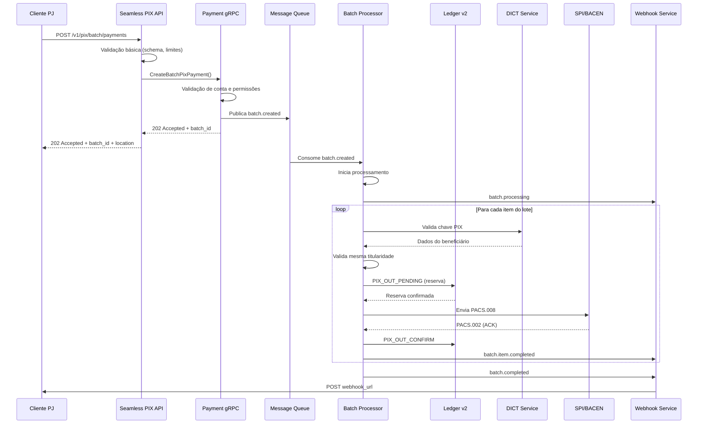

# Especificação: PIX OUT em Lote (Batch PIX Payments)

> **Versão:** 1.0
> **Data:** 2025-12-09
> **Autor:** Equipe LB Pay
> **Status:** Draft - Aguardando Aprovação

---

## Sumário Executivo

Esta especificação descreve a implementação de uma nova funcionalidade na **LB PIX API** que permitirá clientes **Pessoa Jurídica (PJ)** realizarem **pagamentos PIX em lote** (batch payments). A funcionalidade suporta desde **1 pagamento até milhares** em uma única requisição, com processamento assíncrono, validação em massa, e notificações detalhadas via webhook.

### Objetivos de Negócio

- Permitir que clientes PJ realizem folhas de pagamento via PIX
- Reduzir tempo de processamento de múltiplos pagamentos individuais
- Fornecer visibilidade consolidada do status de processamento
- Garantir conformidade regulatória (BACEN, Portaria SPA/ME nº 615/2024)
- Melhorar experiência do cliente com operações em massa

### Escopo

**Inclui:**
- Endpoint REST para criação de lotes de PIX OUT
- Validações em massa (limite, saldo, titularidade, chaves PIX)
- Processamento assíncrono via message queue
- gRPC service no Payment para orchestração
- Consulta de status de lote e pagamentos individuais
- Webhooks para notificação de progresso
- Cancelamento de lote (se ainda não processado)
- Relatório consolidado de lote (CSV/PDF)

**Não Inclui (Fase 1):**
- Agendamento de lotes (futuro)
- Recorrência de lotes
- Aprovação multi-nível (workflow complexo)
- PIX IN em lote (outra feature)

---

## 1. Arquitetura e Fluxo de Dados

### 1.1 Componentes Envolvidos

```
Cliente PJ (ERP)
    ↓
API Gateway (Kong) + Rate Limiting
    ↓
Seamless PIX REST API (:8081)
    ├─ POST /v1/pix/batch/payments (novo)
    ├─ GET /v1/pix/batch/payments/{batch_id} (novo)
    ├─ GET /v1/pix/batch/payments/{batch_id}/items (novo)
    ├─ DELETE /v1/pix/batch/payments/{batch_id} (novo)
    └─ GET /v1/pix/batch/payments/{batch_id}/report (novo)
    ↓
Payment gRPC Service (:50051)
    └─ BatchPixPaymentService (novo service)
        ├─ CreateBatchPixPayment
        ├─ GetBatchPixPayment
        ├─ ListBatchPixPaymentItems
        ├─ CancelBatchPixPayment
        └─ GetBatchPixPaymentReport
    ↓
Message Queue (Pulsar/Kafka)
    └─ Topic: pix.batch.payments
    ↓
Batch Payment Processor (Worker)
    ├─ Validação em massa
    ├─ Reserva de saldo consolidada
    ├─ Processamento item a item
    └─ Publicação de eventos
    ↓
    ├─→ Ledger v2 gRPC (:50051)
    │   └─ PIX_OUT_PENDING, PIX_OUT_CONFIRM
    │
    ├─→ DICT Service
    │   └─ Validação de chaves PIX
    │
    └─→ SPI Service (BACEN)
        └─ Envio de mensagens ISO 20022
    ↓
Webhook Delivery Service
    └─ Notificação ao cliente
        ├─ batch.created
        ├─ batch.processing
        ├─ batch.item.completed
        ├─ batch.item.failed
        ├─ batch.completed
        └─ batch.failed
```

### 1.2 Fluxo de Processamento



---

## 2. Especificação da REST API

### 2.1 Criar Lote de Pagamentos PIX

**Endpoint:** `POST /v1/pix/batch/payments`

**Descrição:** Cria um novo lote de pagamentos PIX para processamento assíncrono.

**Headers:**
```
Authorization: Bearer {access_token}
X-API-Version: 1.0
X-Idempotency-Key: {uuid} (obrigatório)
Content-Type: application/json
```

**Request Body:**
```json
{
  "description": "Folha de Pagamento - Janeiro 2025",
  "account_id": "acc_abc123xyz",
  "total_items": 150,
  "total_amount": "125000.50",
  "scheduled_at": null,
  "callback_url": "https://cliente.com.br/webhooks/pix-batch",
  "items": [
    {
      "external_id": "PAG-001",
      "amount": "1500.00",
      "pix_key": "12345678901",
      "pix_key_type": "cpf",
      "description": "Pagamento - João Silva",
      "payer_info": {
        "name": "Empresa XYZ LTDA",
        "document": "12345678000190"
      },
      "payee_info": {
        "name": "João Silva",
        "document": "12345678901"
      },
      "validate_same_ownership": true
    },
    {
      "external_id": "PAG-002",
      "amount": "2300.50",
      "pix_key": "maria@email.com",
      "pix_key_type": "email",
      "description": "Pagamento - Maria Santos",
      "payer_info": {
        "name": "Empresa XYZ LTDA",
        "document": "12345678000190"
      },
      "payee_info": {
        "name": "Maria Santos",
        "document": "98765432109"
      },
      "validate_same_ownership": false
    }
  ]
}
```

**Validações:**
- `total_items` deve corresponder ao número de items no array
- `total_amount` deve corresponder à soma de todos os `items[].amount`
- Mínimo: 1 item
- Máximo: 1000 items por lote (configurável)
- Cada `amount` deve ser >= 0.01 e <= limite da conta
- `account_id` deve existir e estar ativo
- Saldo disponível deve ser >= `total_amount`
- `external_id` deve ser único dentro do lote
- `pix_key` deve ser válida conforme `pix_key_type`
- Se `validate_same_ownership` = true, valida CPF/CNPJ

**Response: 202 Accepted**
```json
{
  "batch_id": "batch_abc123xyz",
  "status": "pending",
  "description": "Folha de Pagamento - Janeiro 2025",
  "account_id": "acc_abc123xyz",
  "total_items": 150,
  "total_amount": "125000.50",
  "processed_items": 0,
  "successful_items": 0,
  "failed_items": 0,
  "created_at": "2025-01-24T10:30:00Z",
  "updated_at": "2025-01-24T10:30:00Z",
  "scheduled_at": null,
  "started_at": null,
  "completed_at": null,
  "estimated_completion": "2025-01-24T10:35:00Z"
}
```

**Response Headers:**
```
Location: /v1/pix/batch/payments/batch_abc123xyz
X-Request-ID: req_xyz789
```

**Erros Possíveis:**
- `400 Bad Request` - Schema inválido, total_items/total_amount não batem
- `401 Unauthorized` - Token inválido
- `403 Forbidden` - Conta não autorizada para lotes
- `409 Conflict` - Idempotency-Key duplicada
- `422 Unprocessable Entity` - Saldo insuficiente, limite excedido
- `429 Too Many Requests` - Rate limit excedido

---

### 2.2 Consultar Status do Lote

**Endpoint:** `GET /v1/pix/batch/payments/{batch_id}`

**Descrição:** Retorna o status consolidado de um lote de pagamentos.

**Response: 200 OK**
```json
{
  "batch_id": "batch_abc123xyz",
  "status": "processing",
  "description": "Folha de Pagamento - Janeiro 2025",
  "account_id": "acc_abc123xyz",
  "total_items": 150,
  "total_amount": "125000.50",
  "processed_items": 87,
  "successful_items": 85,
  "failed_items": 2,
  "created_at": "2025-01-24T10:30:00Z",
  "updated_at": "2025-01-24T10:33:45Z",
  "scheduled_at": null,
  "started_at": "2025-01-24T10:30:15Z",
  "completed_at": null,
  "estimated_completion": "2025-01-24T10:35:00Z",
  "progress_percentage": 58.0,
  "summary": {
    "total_amount_processed": "72500.00",
    "total_amount_successful": "71200.50",
    "total_amount_failed": "1299.50",
    "total_amount_pending": "52800.50"
  }
}
```

**Status Possíveis:**
- `pending` - Aguardando início do processamento
- `validating` - Validando dados (chaves PIX, saldo, etc)
- `processing` - Processando pagamentos
- `completed` - Todos os items processados (sucesso ou falha)
- `partial_success` - Alguns items falharam
- `failed` - Falha crítica no lote inteiro
- `cancelled` - Cancelado pelo usuário

---

### 2.3 Listar Items do Lote

**Endpoint:** `GET /v1/pix/batch/payments/{batch_id}/items`

**Query Parameters:**
- `status` (opcional): `pending`, `processing`, `completed`, `failed`
- `cursor` (opcional): Cursor de paginação
- `limit` (opcional): Items por página (default: 50, max: 100)

**Response: 200 OK**
```json
{
  "batch_id": "batch_abc123xyz",
  "data": [
    {
      "item_id": "item_001",
      "external_id": "PAG-001",
      "status": "completed",
      "amount": "1500.00",
      "pix_key": "12345678901",
      "pix_key_type": "cpf",
      "description": "Pagamento - João Silva",
      "payee_info": {
        "name": "João Silva",
        "document": "12345678901",
        "bank": "001 - Banco do Brasil",
        "account_type": "checking"
      },
      "e2e_id": "E12345678202501241030ABC123XYZ",
      "txid": "TXB123ABC456DEF789GHI012JKL345MNO",
      "created_at": "2025-01-24T10:30:00Z",
      "processed_at": "2025-01-24T10:31:23Z",
      "error": null
    },
    {
      "item_id": "item_002",
      "external_id": "PAG-002",
      "status": "failed",
      "amount": "2300.50",
      "pix_key": "maria@email.com",
      "pix_key_type": "email",
      "description": "Pagamento - Maria Santos",
      "payee_info": null,
      "e2e_id": null,
      "txid": null,
      "created_at": "2025-01-24T10:30:00Z",
      "processed_at": "2025-01-24T10:31:45Z",
      "error": {
        "code": "invalid_pix_key",
        "message": "Chave PIX não encontrada no DICT",
        "type": "validation_error"
      }
    }
  ],
  "pagination": {
    "total": 150,
    "limit": 50,
    "has_more": true,
    "next_cursor": "eyJpdGVtX2lkIjoiaXRlbV8wNTAifQ=="
  }
}
```

---

### 2.4 Cancelar Lote

**Endpoint:** `DELETE /v1/pix/batch/payments/{batch_id}`

**Descrição:** Cancela um lote que ainda não iniciou processamento ou está em processamento (cancela items pendentes).

**Response: 200 OK**
```json
{
  "batch_id": "batch_abc123xyz",
  "status": "cancelled",
  "cancelled_at": "2025-01-24T10:32:00Z",
  "cancelled_items": 63,
  "message": "Lote cancelado com sucesso. 87 items já processados, 63 items cancelados."
}
```

**Erros:**
- `404 Not Found` - Lote não encontrado
- `409 Conflict` - Lote já completado, não pode ser cancelado

---

### 2.5 Gerar Relatório do Lote

**Endpoint:** `GET /v1/pix/batch/payments/{batch_id}/report`

**Query Parameters:**
- `format` (opcional): `json` (default), `csv`, `pdf`

**Response: 200 OK (format=json)**
```json
{
  "batch_id": "batch_abc123xyz",
  "generated_at": "2025-01-24T10:40:00Z",
  "summary": {
    "total_items": 150,
    "successful_items": 148,
    "failed_items": 2,
    "total_amount": "125000.50",
    "total_amount_successful": "123701.00",
    "total_amount_failed": "1299.50"
  },
  "items": [
    {
      "external_id": "PAG-001",
      "status": "completed",
      "amount": "1500.00",
      "payee_name": "João Silva",
      "payee_document": "12345678901",
      "e2e_id": "E12345678202501241030ABC123XYZ",
      "processed_at": "2025-01-24T10:31:23Z"
    }
  ]
}
```

**Response: 200 OK (format=csv)**
```csv
External ID,Status,Amount,Payee Name,Payee Document,E2E ID,Processed At,Error
PAG-001,completed,1500.00,João Silva,12345678901,E12345678202501241030ABC123XYZ,2025-01-24T10:31:23Z,
PAG-002,failed,2300.50,Maria Santos,98765432109,,2025-01-24T10:31:45Z,Chave PIX não encontrada
```

**Response Headers (format=csv):**
```
Content-Type: text/csv
Content-Disposition: attachment; filename="batch_abc123xyz_report.csv"
```

---

## 3. Especificação gRPC - Payment Service

### 3.1 Proto Definition

**Arquivo:** `/apps/payment/proto/batch_pix_payment.proto`

```protobuf
syntax = "proto3";

package payment.batchpix;

import "google/protobuf/timestamp.proto";

option go_package = "github.com/london-bridge/money-moving/apps/payment/proto/batchpix";

// Service definition
service BatchPixPaymentService {
  rpc CreateBatchPixPayment(CreateBatchPixPaymentRequest) returns (CreateBatchPixPaymentResponse);
  rpc GetBatchPixPayment(GetBatchPixPaymentRequest) returns (BatchPixPaymentResponse);
  rpc ListBatchPixPaymentItems(ListBatchPixPaymentItemsRequest) returns (ListBatchPixPaymentItemsResponse);
  rpc CancelBatchPixPayment(CancelBatchPixPaymentRequest) returns (CancelBatchPixPaymentResponse);
  rpc GetBatchPixPaymentReport(GetBatchPixPaymentReportRequest) returns (BatchPixPaymentReportResponse);
}

// Messages

message CreateBatchPixPaymentRequest {
  string account_id = 1;
  string description = 2;
  int32 total_items = 3;
  string total_amount = 4; // decimal as string
  google.protobuf.Timestamp scheduled_at = 5;
  string callback_url = 6;
  repeated BatchPixPaymentItem items = 7;
  string idempotency_key = 8;
}

message BatchPixPaymentItem {
  string external_id = 1;
  string amount = 2; // decimal as string
  string pix_key = 3;
  PixKeyType pix_key_type = 4;
  string description = 5;
  ParticipantInfo payer_info = 6;
  ParticipantInfo payee_info = 7;
  bool validate_same_ownership = 8;
}

enum PixKeyType {
  PIX_KEY_TYPE_UNSPECIFIED = 0;
  PIX_KEY_TYPE_CPF = 1;
  PIX_KEY_TYPE_CNPJ = 2;
  PIX_KEY_TYPE_EMAIL = 3;
  PIX_KEY_TYPE_PHONE = 4;
  PIX_KEY_TYPE_EVP = 5;
}

message ParticipantInfo {
  string name = 1;
  string document = 2; // CPF or CNPJ
}

message CreateBatchPixPaymentResponse {
  string batch_id = 1;
  BatchStatus status = 2;
  google.protobuf.Timestamp created_at = 3;
  google.protobuf.Timestamp estimated_completion = 4;
}

message GetBatchPixPaymentRequest {
  string batch_id = 1;
}

message BatchPixPaymentResponse {
  string batch_id = 1;
  BatchStatus status = 2;
  string description = 3;
  string account_id = 4;
  int32 total_items = 5;
  string total_amount = 6;
  int32 processed_items = 7;
  int32 successful_items = 8;
  int32 failed_items = 9;
  google.protobuf.Timestamp created_at = 10;
  google.protobuf.Timestamp updated_at = 11;
  google.protobuf.Timestamp scheduled_at = 12;
  google.protobuf.Timestamp started_at = 13;
  google.protobuf.Timestamp completed_at = 14;
  google.protobuf.Timestamp estimated_completion = 15;
  float progress_percentage = 16;
  BatchSummary summary = 17;
}

message BatchSummary {
  string total_amount_processed = 1;
  string total_amount_successful = 2;
  string total_amount_failed = 3;
  string total_amount_pending = 4;
}

enum BatchStatus {
  BATCH_STATUS_UNSPECIFIED = 0;
  BATCH_STATUS_PENDING = 1;
  BATCH_STATUS_VALIDATING = 2;
  BATCH_STATUS_PROCESSING = 3;
  BATCH_STATUS_COMPLETED = 4;
  BATCH_STATUS_PARTIAL_SUCCESS = 5;
  BATCH_STATUS_FAILED = 6;
  BATCH_STATUS_CANCELLED = 7;
}

message ListBatchPixPaymentItemsRequest {
  string batch_id = 1;
  ItemStatus status_filter = 2;
  string cursor = 3;
  int32 limit = 4;
}

message ListBatchPixPaymentItemsResponse {
  string batch_id = 1;
  repeated BatchPixPaymentItemDetail items = 2;
  PaginationInfo pagination = 3;
}

message BatchPixPaymentItemDetail {
  string item_id = 1;
  string external_id = 2;
  ItemStatus status = 3;
  string amount = 4;
  string pix_key = 5;
  PixKeyType pix_key_type = 6;
  string description = 7;
  PayeeInfo payee_info = 8;
  string e2e_id = 9;
  string txid = 10;
  google.protobuf.Timestamp created_at = 11;
  google.protobuf.Timestamp processed_at = 12;
  ItemError error = 13;
}

message PayeeInfo {
  string name = 1;
  string document = 2;
  string bank = 3;
  string account_type = 4;
}

message ItemError {
  string code = 1;
  string message = 2;
  string type = 3;
}

enum ItemStatus {
  ITEM_STATUS_UNSPECIFIED = 0;
  ITEM_STATUS_PENDING = 1;
  ITEM_STATUS_PROCESSING = 2;
  ITEM_STATUS_COMPLETED = 3;
  ITEM_STATUS_FAILED = 4;
  ITEM_STATUS_CANCELLED = 5;
}

message PaginationInfo {
  int32 total = 1;
  int32 limit = 2;
  bool has_more = 3;
  string next_cursor = 4;
}

message CancelBatchPixPaymentRequest {
  string batch_id = 1;
}

message CancelBatchPixPaymentResponse {
  string batch_id = 1;
  BatchStatus status = 2;
  google.protobuf.Timestamp cancelled_at = 3;
  int32 cancelled_items = 4;
  string message = 5;
}

message GetBatchPixPaymentReportRequest {
  string batch_id = 1;
  ReportFormat format = 2;
}

enum ReportFormat {
  REPORT_FORMAT_UNSPECIFIED = 0;
  REPORT_FORMAT_JSON = 1;
  REPORT_FORMAT_CSV = 2;
  REPORT_FORMAT_PDF = 3;
}

message BatchPixPaymentReportResponse {
  string batch_id = 1;
  google.protobuf.Timestamp generated_at = 2;
  ReportSummary summary = 3;
  repeated ReportItem items = 4;
  bytes file_content = 5; // for CSV/PDF formats
  string content_type = 6;
}

message ReportSummary {
  int32 total_items = 1;
  int32 successful_items = 2;
  int32 failed_items = 3;
  string total_amount = 4;
  string total_amount_successful = 5;
  string total_amount_failed = 6;
}

message ReportItem {
  string external_id = 1;
  ItemStatus status = 2;
  string amount = 3;
  string payee_name = 4;
  string payee_document = 5;
  string e2e_id = 6;
  google.protobuf.Timestamp processed_at = 7;
  string error_message = 8;
}
```

---

## 4. Modelo de Dados - PostgreSQL

### 4.1 Tabela: batch_pix_payments

```sql
CREATE TABLE batch_pix_payments (
    id UUID PRIMARY KEY DEFAULT gen_random_uuid(),
    batch_id VARCHAR(50) UNIQUE NOT NULL,
    account_id VARCHAR(50) NOT NULL,
    description TEXT,
    status VARCHAR(20) NOT NULL,
    total_items INTEGER NOT NULL,
    total_amount NUMERIC(15, 2) NOT NULL,
    processed_items INTEGER DEFAULT 0,
    successful_items INTEGER DEFAULT 0,
    failed_items INTEGER DEFAULT 0,
    total_amount_processed NUMERIC(15, 2) DEFAULT 0,
    total_amount_successful NUMERIC(15, 2) DEFAULT 0,
    total_amount_failed NUMERIC(15, 2) DEFAULT 0,
    callback_url TEXT,
    idempotency_key VARCHAR(50) UNIQUE,
    created_at TIMESTAMP WITH TIME ZONE DEFAULT NOW(),
    updated_at TIMESTAMP WITH TIME ZONE DEFAULT NOW(),
    scheduled_at TIMESTAMP WITH TIME ZONE,
    started_at TIMESTAMP WITH TIME ZONE,
    completed_at TIMESTAMP WITH TIME ZONE,
    cancelled_at TIMESTAMP WITH TIME ZONE,
    estimated_completion TIMESTAMP WITH TIME ZONE,

    INDEX idx_batch_pix_payments_batch_id (batch_id),
    INDEX idx_batch_pix_payments_account_id (account_id),
    INDEX idx_batch_pix_payments_status (status),
    INDEX idx_batch_pix_payments_created_at (created_at DESC)
);

-- Status enum constraint
ALTER TABLE batch_pix_payments
ADD CONSTRAINT chk_batch_status
CHECK (status IN ('pending', 'validating', 'processing', 'completed', 'partial_success', 'failed', 'cancelled'));
```

### 4.2 Tabela: batch_pix_payment_items

```sql
CREATE TABLE batch_pix_payment_items (
    id UUID PRIMARY KEY DEFAULT gen_random_uuid(),
    item_id VARCHAR(50) UNIQUE NOT NULL,
    batch_id VARCHAR(50) NOT NULL REFERENCES batch_pix_payments(batch_id) ON DELETE CASCADE,
    external_id VARCHAR(100) NOT NULL,
    status VARCHAR(20) NOT NULL,
    amount NUMERIC(15, 2) NOT NULL,
    pix_key VARCHAR(77) NOT NULL,
    pix_key_type VARCHAR(10) NOT NULL,
    description TEXT,
    payer_name VARCHAR(200),
    payer_document VARCHAR(14),
    payee_name VARCHAR(200),
    payee_document VARCHAR(14),
    payee_bank VARCHAR(100),
    payee_account_type VARCHAR(20),
    validate_same_ownership BOOLEAN DEFAULT false,
    e2e_id VARCHAR(32),
    txid VARCHAR(35),
    error_code VARCHAR(50),
    error_message TEXT,
    error_type VARCHAR(50),
    created_at TIMESTAMP WITH TIME ZONE DEFAULT NOW(),
    processed_at TIMESTAMP WITH TIME ZONE,

    INDEX idx_batch_items_batch_id (batch_id),
    INDEX idx_batch_items_item_id (item_id),
    INDEX idx_batch_items_external_id (external_id),
    INDEX idx_batch_items_status (status),
    INDEX idx_batch_items_e2e_id (e2e_id),
    UNIQUE (batch_id, external_id)
);

-- Status enum constraint
ALTER TABLE batch_pix_payment_items
ADD CONSTRAINT chk_item_status
CHECK (status IN ('pending', 'processing', 'completed', 'failed', 'cancelled'));

-- PIX key type constraint
ALTER TABLE batch_pix_payment_items
ADD CONSTRAINT chk_pix_key_type
CHECK (pix_key_type IN ('cpf', 'cnpj', 'email', 'phone', 'evp'));
```

### 4.3 Índices Adicionais

```sql
-- Índice composto para consultas filtradas por batch + status
CREATE INDEX idx_batch_items_batch_status ON batch_pix_payment_items(batch_id, status);

-- Índice para consultas por data
CREATE INDEX idx_batch_items_processed_at ON batch_pix_payment_items(processed_at DESC);

-- Índice para busca por documento
CREATE INDEX idx_batch_items_payee_document ON batch_pix_payment_items(payee_document);
```

---

## 5. Validações e Regras de Negócio

### 5.1 Validações no Momento da Criação

| Validação | Regra | Erro |
|-----------|-------|------|
| Quantidade mínima | >= 1 item | `invalid_batch_size` |
| Quantidade máxima | <= 1000 items (configurável) | `batch_size_exceeded` |
| Total items | `total_items` == `len(items)` | `total_items_mismatch` |
| Total amount | `total_amount` == `sum(items[].amount)` | `total_amount_mismatch` |
| Saldo disponível | Saldo >= `total_amount` | `insufficient_balance` |
| Conta ativa | Status da conta == `active` | `account_not_active` |
| Permissão PJ | Conta tipo == `business` | `individual_not_allowed` |
| External ID único | Dentro do lote | `duplicate_external_id` |
| Formato PIX key | Conforme `pix_key_type` | `invalid_pix_key_format` |
| CPF/CNPJ formato | 11 ou 14 dígitos | `invalid_document_format` |
| Amount válido | >= 0.01 e <= limite da conta | `invalid_amount` |

### 5.2 Validações Durante Processamento

| Validação | Serviço | Ação em Erro |
|-----------|---------|--------------|
| Chave PIX existe | DICT | Marca item como `failed` |
| Mesma titularidade | DICT + Validação | Marca item como `failed` se obrigatório |
| Saldo disponível (recheck) | Ledger v2 | Cancela items restantes se saldo insuficiente |
| Limite transacional | Account Service | Marca item como `failed` |
| Conta beneficiário ativa | SPI/BACEN | Marca item como `failed` |

### 5.3 Política de Retry

**Item Individual:**
- Falhas transientes (timeout, network): 3 tentativas com backoff exponencial
- Falhas permanentes (chave inválida, conta bloqueada): Não retenta

**Lote Completo:**
- Falha crítica no início: Cancela todo o lote
- Falha parcial: Continua processando items restantes

---

## 6. Eventos e Webhooks

### 6.1 Eventos Publicados

| Evento | Quando | Payload |
|--------|--------|---------|
| `batch.created` | Lote criado | `batch_id`, `total_items`, `total_amount` |
| `batch.validating` | Iniciou validação | `batch_id`, `status` |
| `batch.processing` | Iniciou processamento | `batch_id`, `processed_items` |
| `batch.item.completed` | Item processado com sucesso | `batch_id`, `item_id`, `e2e_id` |
| `batch.item.failed` | Item falhou | `batch_id`, `item_id`, `error` |
| `batch.completed` | Todos items processados | `batch_id`, `summary` |
| `batch.partial_success` | Concluído com falhas | `batch_id`, `summary` |
| `batch.failed` | Falha crítica | `batch_id`, `error` |
| `batch.cancelled` | Lote cancelado | `batch_id`, `cancelled_items` |

### 6.2 Webhook Payload Exemplo

```json
{
  "event": "batch.item.completed",
  "timestamp": "2025-01-24T10:31:23Z",
  "data": {
    "batch_id": "batch_abc123xyz",
    "item_id": "item_001",
    "external_id": "PAG-001",
    "status": "completed",
    "amount": "1500.00",
    "payee_name": "João Silva",
    "payee_document": "12345678901",
    "e2e_id": "E12345678202501241030ABC123XYZ",
    "txid": "TXB123ABC456DEF789GHI012JKL345MNO",
    "processed_at": "2025-01-24T10:31:23Z"
  },
  "progress": {
    "total_items": 150,
    "processed_items": 87,
    "successful_items": 85,
    "failed_items": 2,
    "progress_percentage": 58.0
  }
}
```

---

## 7. Performance e Escalabilidade

### 7.1 Capacidade Esperada

| Métrica | Valor Alvo |
|---------|------------|
| Lotes por hora | 10,000 lotes |
| Items por segundo | 500 items/seg |
| Latência criação (p95) | < 500ms |
| Latência processamento/item | 200-300ms |
| Tamanho máximo lote | 1,000 items |
| Tempo processamento lote 1000 items | ~5-7 minutos |

### 7.2 Estratégia de Processamento

**Worker Pool:**
- 10 workers paralelos por instância
- Cada worker processa 1 item por vez
- Auto-scaling baseado em tamanho da fila

**Throttling:**
- Máximo 50 lotes simultâneos por cliente
- Máximo 5,000 items pendentes por cliente

### 7.3 Otimizações

1. **Validação em Batch (DICT):**
   - Consultar múltiplas chaves PIX em uma única requisição
   - Cache de resultados por 5 minutos

2. **Reserva de Saldo Consolidada:**
   - Uma única reserva no Ledger v2 para todo o lote
   - Liberação incremental conforme processamento

3. **Paralelização:**
   - Processar items em paralelo (10-20 items simultâneos)
   - Respeitar ordem apenas se explicitamente solicitado

4. **Circuit Breaker:**
   - Para SPI/BACEN se taxa de erro > 50%
   - Retry automático após 1 minuto

---

## 8. Segurança e Compliance

### 8.1 Autenticação e Autorização

- **OAuth 2.0 + mTLS** obrigatório
- Scope requerido: `pix.batch.write`, `pix.batch.read`
- Apenas contas PJ (business accounts)
- Limite de lotes baseado no contrato do cliente

### 8.2 Auditoria e Logs

**Logs Obrigatórios (5 anos):**
- Criação de lote: `batch_id`, `account_id`, `total_items`, `total_amount`
- Processamento de item: `item_id`, `e2e_id`, `pix_key`, `amount`, `payee_document`
- Validação de titularidade: `payer_document`, `payee_document`, `validation_result`
- Falhas: `item_id`, `error_code`, `error_message`

### 8.3 Conformidade

**Portaria SPA/ME nº 615/2024:**
- Validação de mesma titularidade quando `validate_same_ownership = true`
- Logs detalhados de todas as validações

**BACEN Resolução BCB nº 1/2020:**
- E2E ID gerado conforme especificação
- Rastreabilidade completa de cada item

**LGPD:**
- Anonimização de dados após 5 anos
- Direito ao esquecimento (requer aprovação legal)

---

## 9. Monitoramento e Alertas

### 9.1 Métricas

| Métrica | Tipo | Alerta |
|---------|------|--------|
| `batch_pix_created_total` | Counter | - |
| `batch_pix_processing_duration_seconds` | Histogram | p95 > 10min |
| `batch_pix_item_processed_total` | Counter por status | - |
| `batch_pix_item_processing_duration_seconds` | Histogram | p95 > 500ms |
| `batch_pix_errors_total` | Counter por error_code | > 10% |
| `batch_pix_queue_size` | Gauge | > 10,000 |
| `batch_pix_worker_utilization` | Gauge | > 90% |

### 9.2 Dashboards

**Dashboard: Batch PIX Overview**
- Total de lotes criados (últimas 24h)
- Lotes em processamento
- Taxa de sucesso (%)
- Tempo médio de processamento
- Top 10 erros

**Dashboard: Item Processing**
- Items processados/segundo
- Taxa de sucesso por item
- Latência p50/p95/p99
- Distribuição de erros

### 9.3 Alertas

| Alerta | Condição | Severidade |
|--------|----------|------------|
| Taxa de erro alta | > 10% em 5min | Critical |
| Processamento lento | p95 > 15min | Warning |
| Fila crescente | > 20,000 items | Warning |
| Worker down | < 50% workers ativos | Critical |
| DICT timeout | > 5% timeouts | Warning |
| SPI indisponível | > 3 falhas consecutivas | Critical |

---

## 10. Plano de Implementação

### 10.1 Fases

**Fase 1: Fundação (Sprint 1-2)**
- Proto definitions
- Database schema
- gRPC service skeleton
- REST API endpoints
- Testes unitários

**Fase 2: Core Logic (Sprint 3-4)**
- Batch processor worker
- DICT integration
- Ledger v2 integration
- Validações de negócio
- Testes de integração

**Fase 3: Webhooks & Eventos (Sprint 5)**
- Event publishing
- Webhook delivery
- Retry logic
- Testes end-to-end

**Fase 4: Relatórios & UI (Sprint 6)**
- Report generation (JSON/CSV/PDF)
- Dashboard updates
- Monitoramento
- Documentação

**Fase 5: Performance & Produção (Sprint 7-8)**
- Load testing
- Performance tuning
- Circuit breaker
- Rollout gradual (canary)

### 10.2 Dependências

| Componente | Dependência |
|------------|-------------|
| REST API | gRPC service pronto |
| Batch Processor | DICT client, Ledger v2 client |
| Webhooks | Event publishing |
| Relatórios | Batch processor completo |

### 10.3 Riscos

| Risco | Impacto | Mitigação |
|-------|---------|-----------|
| DICT rate limiting | Alto | Cache + batch queries |
| SPI downtime | Alto | Circuit breaker + retry |
| Saldo insuficiente mid-processing | Médio | Reserva antecipada |
| Lotes muito grandes | Médio | Limite de 1000 items |
| Memory leaks em workers | Alto | Health checks + auto-restart |

---

## 11. Testes

### 11.1 Cenários de Teste

**Testes Unitários:**
- Validação de schema
- Cálculo de totais
- Parsing de PIX keys
- Status transitions

**Testes de Integração:**
- Criação de lote via REST
- Consulta de status
- Listagem de items
- Cancelamento

**Testes End-to-End:**
- Lote com 1 item
- Lote com 100 items
- Lote com items mistos (sucesso + falha)
- Lote com saldo insuficiente
- Cancelamento durante processamento

**Testes de Performance:**
- 1,000 lotes com 100 items cada
- 100 lotes com 1,000 items cada
- Carga sustentada: 500 items/seg por 1 hora

### 11.2 Dados de Teste (Sandbox)

```json
{
  "account_id": "acc_test_123",
  "items": [
    {
      "external_id": "TEST-001",
      "amount": "10.00",
      "pix_key": "12345678901",
      "pix_key_type": "cpf",
      "description": "Teste - Sucesso"
    },
    {
      "external_id": "TEST-002",
      "amount": "20.00",
      "pix_key": "invalid@test.com",
      "pix_key_type": "email",
      "description": "Teste - Chave Inválida (deve falhar)"
    }
  ]
}
```

---

## 12. Documentação

### 12.1 Entregáveis

- [ ] README.md no repo
- [ ] OpenAPI/Swagger spec
- [ ] Proto documentation (protoc-gen-doc)
- [ ] Postman collection
- [ ] Guia de integração para clientes
- [ ] Troubleshooting guide
- [ ] Runbook para operações

### 12.2 Exemplos de Código

**cURL:**
```bash
curl -X POST https://api.lbpay.com.br/v1/pix/batch/payments \
  -H "Authorization: Bearer ${ACCESS_TOKEN}" \
  -H "X-API-Version: 1.0" \
  -H "X-Idempotency-Key: $(uuidgen)" \
  -H "Content-Type: application/json" \
  -d @batch_payment.json
```

**Python SDK (futuro):**
```python
from lbpay import LBPayClient

client = LBPayClient(access_token="...")
batch = client.pix.batch.create(
    description="Folha Jan/2025",
    items=[
        {"external_id": "PAG-001", "amount": 1500.00, "pix_key": "12345678901"},
        {"external_id": "PAG-002", "amount": 2300.50, "pix_key": "maria@email.com"}
    ]
)
print(f"Batch ID: {batch.batch_id}")
```

---

## 13. Aprovações

| Papel | Nome | Data | Assinatura |
|-------|------|------|------------|
| Product Owner | | | |
| Tech Lead | | | |
| Arquiteto | | | |
| Compliance Officer | | | |
| Security Lead | | | |

---

## 14. Próximos Passos

1. **Revisão desta especificação** com stakeholders
2. **Aprovação final** de Product e Tech Lead
3. **Criação de épicos e user stories** no Jira
4. **Definição de sprints e kanban** com a squad
5. **Kick-off meeting** com todo o time

---

## Apêndices

### Apêndice A: Glossário

- **Lote (Batch)**: Conjunto de pagamentos PIX agrupados para processamento
- **Item**: Um pagamento individual dentro de um lote
- **E2E ID**: End-to-End ID, identificador único BACEN
- **TxID**: Transaction ID, identificador da transação
- **DICT**: Diretório de Identificadores de Contas Transacionais (PIX keys)
- **SPI**: Sistema de Pagamentos Instantâneos (rede PIX do BACEN)
- **Mesma Titularidade**: Validação de que pagador e beneficiário têm mesmo CPF/CNPJ

### Apêndice B: Referências

- [API LB PIX v1.0 Specification](./API_LB.md)
- [BACEN - Manual do PIX](https://www.bcb.gov.br/estabilidadefinanceira/pix)
- [Portaria SPA/ME nº 615/2024](https://www.in.gov.br/...)
- [ISO 20022 PACS.008 Specification](https://www.iso20022.org/)

### Apêndice C: Changelog

| Versão | Data | Autor | Mudanças |
|--------|------|-------|----------|
| 1.0 | 2025-12-09 | Equipe LB Pay | Versão inicial |

---

**Fim da Especificação**
