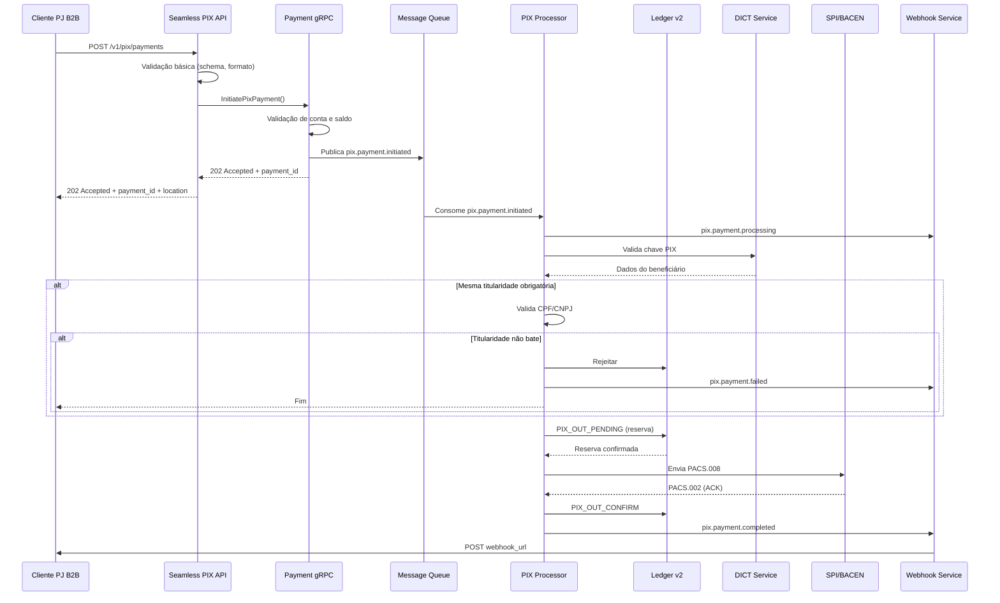

# Especificação: PIX OUT B2B - Pagamentos Unitários

> **Versão:** 1.0
> **Data:** 2025-12-09
> **Autor:** Equipe LB Pay
> **Status:** Draft - Aguardando Aprovação

---

## Sumário Executivo

Esta especificação descreve a implementação de **pagamentos PIX unitários (pix a pix)** na **LB PIX API** para clientes **Pessoa Jurídica (PJ)**. A funcionalidade permite que empresas B2B realizem transferências PIX individuais de forma simples e eficiente, com validação de mesma titularidade, processamento assíncrono e notificações via webhook.

### Objetivos de Negócio

- Permitir que clientes PJ B2B realizem pagamentos PIX individuais via API
- Fornecer processamento assíncrono para operações PIX OUT
- Garantir conformidade regulatória (BACEN, Portaria SPA/ME nº 615/2024)
- Validar mesma titularidade quando aplicável
- Fornecer rastreabilidade completa de transações
- Melhorar experiência do cliente B2B com API simplificada

### Escopo

**Inclui:**
- Endpoint REST para envio de PIX OUT unitário
- Validações (limite, saldo, titularidade, chave PIX)
- Processamento assíncrono via message queue
- gRPC service no Payment para orchestração
- Consulta de status de pagamento
- Webhooks para notificação de status
- Consulta de histórico de pagamentos
- Cancelamento de pagamento (se ainda não processado)

**Não Inclui (Fase 1):**
- Pagamentos em lote (removido do escopo)
- Agendamento de pagamentos (futuro)
- PIX recorrente (futuro)
- QR Code dinâmico (já existe em outra feature)

---

## 1. Arquitetura e Fluxo de Dados

### 1.1 Componentes Envolvidos

```
Cliente PJ B2B (ERP)
    ↓
API Gateway (Kong) + Rate Limiting
    ↓
Seamless PIX REST API (:8081)
    ├─ POST /v1/pix/payments (novo - B2B)
    ├─ GET /v1/pix/payments/{payment_id} (novo)
    ├─ GET /v1/pix/payments (listar - novo)
    └─ DELETE /v1/pix/payments/{payment_id} (cancelar)
    ↓
Payment gRPC Service (:50051)
    └─ PixPaymentService (existente, com extensões)
        ├─ InitiatePixPayment (novo método)
        ├─ GetPixPayment (novo método)
        ├─ ListPixPayments (novo método)
        └─ CancelPixPayment (novo método)
    ↓
Message Queue (Pulsar/Kafka)
    └─ Topic: pix.payments.b2b
    ↓
PIX Payment Processor (Worker)
    ├─ Validação de chave PIX
    ├─ Validação de mesma titularidade
    ├─ Reserva de saldo
    └─ Envio para SPI/BACEN
    ↓
    ├─→ Ledger v2 gRPC (:50051)
    │   └─ PIX_OUT_PENDING, PIX_OUT_CONFIRM, PIX_OUT_REJECT
    │
    ├─→ DICT Service
    │   └─ Validação de chaves PIX
    │
    └─→ SPI Service (BACEN)
        └─ Envio de mensagens ISO 20022 (PACS.008)
    ↓
Webhook Delivery Service
    └─ Notificação ao cliente
        ├─ pix.payment.pending
        ├─ pix.payment.processing
        ├─ pix.payment.completed
        └─ pix.payment.failed
```

### 1.2 Fluxo de Processamento



---

## 2. Especificação da REST API

### 2.1 Enviar Pagamento PIX

**Endpoint:** `POST /v1/pix/payments`

**Descrição:** Inicia um pagamento PIX unitário para processamento assíncrono.

**Headers:**
```
Authorization: Bearer {access_token}
X-API-Version: 1.0
X-Idempotency-Key: {uuid} (obrigatório)
Content-Type: application/json
```

**Request Body:**
```json
{
  "amount": "1500.50",
  "pix_key": "12345678901",
  "pix_key_type": "cpf",
  "description": "Pagamento de fornecedor - NF 12345",
  "payer_info": {
    "account_id": "acc_abc123xyz",
    "name": "Empresa XYZ LTDA",
    "document": "12345678000190"
  },
  "payee_info": {
    "name": "João Silva",
    "document": "12345678901"
  },
  "validate_same_ownership": true,
  "callback_url": "https://empresa.com.br/webhooks/pix",
  "metadata": {
    "invoice_number": "NF-12345",
    "customer_id": "CUST-789",
    "department": "procurement"
  }
}
```

**Campos:**

| Campo | Tipo | Obrigatório | Descrição |
|-------|------|-------------|-----------|
| `amount` | string (decimal) | Sim | Valor do pagamento (min: 0.01) |
| `pix_key` | string | Sim | Chave PIX do beneficiário |
| `pix_key_type` | enum | Sim | Tipo: `cpf`, `cnpj`, `email`, `phone`, `evp` |
| `description` | string | Não | Descrição do pagamento (max 140 chars) |
| `payer_info.account_id` | string | Sim | ID da conta pagadora |
| `payer_info.name` | string | Sim | Nome do pagador |
| `payer_info.document` | string | Sim | CPF/CNPJ do pagador |
| `payee_info.name` | string | Não | Nome do beneficiário (opcional) |
| `payee_info.document` | string | Condicional | Obrigatório se `validate_same_ownership = true` |
| `validate_same_ownership` | boolean | Não | Default: false. Se true, valida CPF/CNPJ |
| `callback_url` | string (URL) | Não | URL para receber webhooks |
| `metadata` | object | Não | Dados customizados (max 10 campos) |

**Validações:**
- `amount` deve ser >= 0.01 e <= limite da conta
- `account_id` deve existir e estar ativo
- Saldo disponível deve ser >= `amount`
- `pix_key` deve ser válida conforme `pix_key_type`
- `document` deve ter 11 dígitos (CPF) ou 14 dígitos (CNPJ)
- Se `validate_same_ownership` = true, `payee_info.document` é obrigatório
- `callback_url` deve ser HTTPS (se fornecido)
- `metadata` valores devem ser strings (max 255 chars cada)

**Response: 202 Accepted**
```json
{
  "payment_id": "pix_abc123xyz",
  "status": "pending",
  "amount": "1500.50",
  "pix_key": "12345678901",
  "pix_key_type": "cpf",
  "description": "Pagamento de fornecedor - NF 12345",
  "payer_info": {
    "account_id": "acc_abc123xyz",
    "name": "Empresa XYZ LTDA",
    "document": "12345678000190"
  },
  "created_at": "2025-01-24T10:30:00Z",
  "estimated_completion": "2025-01-24T10:30:30Z"
}
```

**Response Headers:**
```
Location: /v1/pix/payments/pix_abc123xyz
X-Request-ID: req_xyz789
```

**Erros Possíveis:**
- `400 Bad Request` - Schema inválido, formato incorreto
- `401 Unauthorized` - Token inválido
- `403 Forbidden` - Conta não autorizada para PIX OUT
- `409 Conflict` - Idempotency-Key duplicada
- `422 Unprocessable Entity` - Saldo insuficiente, chave PIX inválida
- `429 Too Many Requests` - Rate limit excedido

---

### 2.2 Consultar Status do Pagamento

**Endpoint:** `GET /v1/pix/payments/{payment_id}`

**Descrição:** Retorna o status e detalhes de um pagamento PIX.

**Response: 200 OK**
```json
{
  "payment_id": "pix_abc123xyz",
  "status": "completed",
  "amount": "1500.50",
  "pix_key": "12345678901",
  "pix_key_type": "cpf",
  "description": "Pagamento de fornecedor - NF 12345",
  "payer_info": {
    "account_id": "acc_abc123xyz",
    "name": "Empresa XYZ LTDA",
    "document": "12345678000190"
  },
  "payee_info": {
    "name": "João Silva",
    "document": "12345678901",
    "bank": "001 - Banco do Brasil",
    "account_type": "checking",
    "ispb": "00000000"
  },
  "e2e_id": "E12345678202501241030ABC123XYZ",
  "txid": "TXB123ABC456DEF789GHI012JKL345MNO",
  "created_at": "2025-01-24T10:30:00Z",
  "processed_at": "2025-01-24T10:30:25Z",
  "completed_at": "2025-01-24T10:30:27Z",
  "metadata": {
    "invoice_number": "NF-12345",
    "customer_id": "CUST-789",
    "department": "procurement"
  },
  "validation": {
    "same_ownership_required": true,
    "same_ownership_result": "valid",
    "pix_key_validated": true
  },
  "error": null
}
```

**Status Possíveis:**
- `pending` - Aguardando processamento
- `validating` - Validando chave PIX e titularidade
- `processing` - Enviando para SPI/BACEN
- `completed` - Pagamento concluído com sucesso
- `failed` - Pagamento falhou (ver campo `error`)
- `cancelled` - Cancelado pelo usuário

**Erro (quando status = failed):**
```json
{
  "payment_id": "pix_abc123xyz",
  "status": "failed",
  "error": {
    "code": "invalid_pix_key",
    "message": "Chave PIX não encontrada no DICT",
    "type": "validation_error",
    "timestamp": "2025-01-24T10:30:15Z"
  }
}
```

---

### 2.3 Listar Pagamentos

**Endpoint:** `GET /v1/pix/payments`

**Query Parameters:**
- `account_id` (opcional): Filtrar por conta
- `status` (opcional): `pending`, `processing`, `completed`, `failed`, `cancelled`
- `start_date` (opcional): ISO 8601 (ex: `2025-01-01T00:00:00Z`)
- `end_date` (opcional): ISO 8601
- `cursor` (opcional): Cursor de paginação
- `limit` (opcional): Items por página (default: 50, max: 100)

**Response: 200 OK**
```json
{
  "data": [
    {
      "payment_id": "pix_abc123xyz",
      "status": "completed",
      "amount": "1500.50",
      "pix_key": "12345678901",
      "description": "Pagamento de fornecedor - NF 12345",
      "payee_name": "João Silva",
      "e2e_id": "E12345678202501241030ABC123XYZ",
      "created_at": "2025-01-24T10:30:00Z",
      "completed_at": "2025-01-24T10:30:27Z"
    },
    {
      "payment_id": "pix_def456uvw",
      "status": "failed",
      "amount": "2300.00",
      "pix_key": "maria@email.com",
      "description": "Pagamento fornecedor - NF 12346",
      "payee_name": null,
      "e2e_id": null,
      "created_at": "2025-01-24T11:15:00Z",
      "completed_at": null,
      "error": {
        "code": "invalid_pix_key",
        "message": "Chave PIX não encontrada"
      }
    }
  ],
  "pagination": {
    "total": 245,
    "limit": 50,
    "has_more": true,
    "next_cursor": "eyJpZCI6InBpeF9naGkifQ=="
  }
}
```

---

### 2.4 Cancelar Pagamento

**Endpoint:** `DELETE /v1/pix/payments/{payment_id}`

**Descrição:** Cancela um pagamento que ainda não foi processado (status `pending` ou `validating`).

**Response: 200 OK**
```json
{
  "payment_id": "pix_abc123xyz",
  "status": "cancelled",
  "cancelled_at": "2025-01-24T10:31:00Z",
  "message": "Pagamento cancelado com sucesso"
}
```

**Erros:**
- `404 Not Found` - Pagamento não encontrado
- `409 Conflict` - Pagamento já processado, não pode ser cancelado

---

## 3. Especificação gRPC - Payment Service

### 3.1 Proto Definition

**Arquivo:** `/apps/payment/proto/pix_payment_b2b.proto`

```protobuf
syntax = "proto3";

package payment.pixb2b;

import "google/protobuf/timestamp.proto";

option go_package = "github.com/london-bridge/money-moving/apps/payment/proto/pixb2b";

// Service definition
service PixPaymentB2BService {
  rpc InitiatePixPayment(InitiatePixPaymentRequest) returns (InitiatePixPaymentResponse);
  rpc GetPixPayment(GetPixPaymentRequest) returns (PixPaymentResponse);
  rpc ListPixPayments(ListPixPaymentsRequest) returns (ListPixPaymentsResponse);
  rpc CancelPixPayment(CancelPixPaymentRequest) returns (CancelPixPaymentResponse);
}

// Messages

message InitiatePixPaymentRequest {
  string amount = 1; // decimal as string
  string pix_key = 2;
  PixKeyType pix_key_type = 3;
  string description = 4;
  PayerInfo payer_info = 5;
  PayeeInfo payee_info = 6;
  bool validate_same_ownership = 7;
  string callback_url = 8;
  map<string, string> metadata = 9;
  string idempotency_key = 10;
}

enum PixKeyType {
  PIX_KEY_TYPE_UNSPECIFIED = 0;
  PIX_KEY_TYPE_CPF = 1;
  PIX_KEY_TYPE_CNPJ = 2;
  PIX_KEY_TYPE_EMAIL = 3;
  PIX_KEY_TYPE_PHONE = 4;
  PIX_KEY_TYPE_EVP = 5;
}

message PayerInfo {
  string account_id = 1;
  string name = 2;
  string document = 3; // CPF or CNPJ
}

message PayeeInfo {
  string name = 1;
  string document = 2;
  string bank = 3;
  string account_type = 4;
  string ispb = 5;
}

message InitiatePixPaymentResponse {
  string payment_id = 1;
  PaymentStatus status = 2;
  google.protobuf.Timestamp created_at = 3;
  google.protobuf.Timestamp estimated_completion = 4;
}

message GetPixPaymentRequest {
  string payment_id = 1;
}

message PixPaymentResponse {
  string payment_id = 1;
  PaymentStatus status = 2;
  string amount = 3;
  string pix_key = 4;
  PixKeyType pix_key_type = 5;
  string description = 6;
  PayerInfo payer_info = 7;
  PayeeInfo payee_info = 8;
  string e2e_id = 9;
  string txid = 10;
  google.protobuf.Timestamp created_at = 11;
  google.protobuf.Timestamp processed_at = 12;
  google.protobuf.Timestamp completed_at = 13;
  map<string, string> metadata = 14;
  ValidationInfo validation = 15;
  PaymentError error = 16;
}

enum PaymentStatus {
  PAYMENT_STATUS_UNSPECIFIED = 0;
  PAYMENT_STATUS_PENDING = 1;
  PAYMENT_STATUS_VALIDATING = 2;
  PAYMENT_STATUS_PROCESSING = 3;
  PAYMENT_STATUS_COMPLETED = 4;
  PAYMENT_STATUS_FAILED = 5;
  PAYMENT_STATUS_CANCELLED = 6;
}

message ValidationInfo {
  bool same_ownership_required = 1;
  string same_ownership_result = 2; // "valid", "invalid", "not_checked"
  bool pix_key_validated = 3;
}

message PaymentError {
  string code = 1;
  string message = 2;
  string type = 3;
  google.protobuf.Timestamp timestamp = 4;
}

message ListPixPaymentsRequest {
  string account_id = 1;
  PaymentStatus status_filter = 2;
  google.protobuf.Timestamp start_date = 3;
  google.protobuf.Timestamp end_date = 4;
  string cursor = 5;
  int32 limit = 6;
}

message ListPixPaymentsResponse {
  repeated PixPaymentSummary payments = 1;
  PaginationInfo pagination = 2;
}

message PixPaymentSummary {
  string payment_id = 1;
  PaymentStatus status = 2;
  string amount = 3;
  string pix_key = 4;
  string description = 5;
  string payee_name = 6;
  string e2e_id = 7;
  google.protobuf.Timestamp created_at = 8;
  google.protobuf.Timestamp completed_at = 9;
  PaymentError error = 10;
}

message PaginationInfo {
  int32 total = 1;
  int32 limit = 2;
  bool has_more = 3;
  string next_cursor = 4;
}

message CancelPixPaymentRequest {
  string payment_id = 1;
}

message CancelPixPaymentResponse {
  string payment_id = 1;
  PaymentStatus status = 2;
  google.protobuf.Timestamp cancelled_at = 3;
  string message = 4;
}
```

---

## 4. Modelo de Dados - PostgreSQL

### 4.1 Tabela: pix_payments_b2b

```sql
CREATE TABLE pix_payments_b2b (
    id UUID PRIMARY KEY DEFAULT gen_random_uuid(),
    payment_id VARCHAR(50) UNIQUE NOT NULL,
    account_id VARCHAR(50) NOT NULL,
    status VARCHAR(20) NOT NULL,

    -- Payment details
    amount NUMERIC(15, 2) NOT NULL,
    pix_key VARCHAR(77) NOT NULL,
    pix_key_type VARCHAR(10) NOT NULL,
    description TEXT,

    -- Payer info
    payer_name VARCHAR(200) NOT NULL,
    payer_document VARCHAR(14) NOT NULL,

    -- Payee info
    payee_name VARCHAR(200),
    payee_document VARCHAR(14),
    payee_bank VARCHAR(100),
    payee_account_type VARCHAR(20),
    payee_ispb VARCHAR(8),

    -- Transaction IDs
    e2e_id VARCHAR(32),
    txid VARCHAR(35),

    -- Validation
    validate_same_ownership BOOLEAN DEFAULT false,
    same_ownership_result VARCHAR(20),
    pix_key_validated BOOLEAN DEFAULT false,

    -- Webhook
    callback_url TEXT,

    -- Metadata
    metadata JSONB,

    -- Error
    error_code VARCHAR(50),
    error_message TEXT,
    error_type VARCHAR(50),
    error_timestamp TIMESTAMP WITH TIME ZONE,

    -- Idempotency
    idempotency_key VARCHAR(50) UNIQUE,

    -- Timestamps
    created_at TIMESTAMP WITH TIME ZONE DEFAULT NOW(),
    processed_at TIMESTAMP WITH TIME ZONE,
    completed_at TIMESTAMP WITH TIME ZONE,
    cancelled_at TIMESTAMP WITH TIME ZONE,

    -- Indexes
    INDEX idx_pix_payments_payment_id (payment_id),
    INDEX idx_pix_payments_account_id (account_id),
    INDEX idx_pix_payments_status (status),
    INDEX idx_pix_payments_created_at (created_at DESC),
    INDEX idx_pix_payments_e2e_id (e2e_id),
    INDEX idx_pix_payments_payer_document (payer_document),
    INDEX idx_pix_payments_payee_document (payee_document)
);

-- Status enum constraint
ALTER TABLE pix_payments_b2b
ADD CONSTRAINT chk_payment_status
CHECK (status IN ('pending', 'validating', 'processing', 'completed', 'failed', 'cancelled'));

-- PIX key type constraint
ALTER TABLE pix_payments_b2b
ADD CONSTRAINT chk_pix_key_type
CHECK (pix_key_type IN ('cpf', 'cnpj', 'email', 'phone', 'evp'));
```

### 4.2 Índices Compostos

```sql
-- Índice para consultas filtradas por account + status
CREATE INDEX idx_pix_payments_account_status
ON pix_payments_b2b(account_id, status);

-- Índice para consultas por data
CREATE INDEX idx_pix_payments_created_status
ON pix_payments_b2b(created_at DESC, status);

-- Índice para metadata (GIN para JSONB)
CREATE INDEX idx_pix_payments_metadata
ON pix_payments_b2b USING GIN (metadata);
```

---

## 5. Validações e Regras de Negócio

### 5.1 Validações no Momento da Criação

| Validação | Regra | Erro |
|-----------|-------|------|
| Amount válido | >= 0.01 e <= limite da conta | `invalid_amount` |
| Saldo disponível | Saldo >= `amount` | `insufficient_balance` |
| Conta ativa | Status da conta == `active` | `account_not_active` |
| Formato PIX key | Conforme `pix_key_type` | `invalid_pix_key_format` |
| CPF/CNPJ formato | 11 ou 14 dígitos | `invalid_document_format` |
| Callback URL | HTTPS obrigatório | `invalid_callback_url` |
| Metadata | Max 10 campos, valores string <= 255 chars | `invalid_metadata` |
| Idempotency key | UUID válido | `invalid_idempotency_key` |

### 5.2 Validações Durante Processamento

| Validação | Serviço | Ação em Erro |
|-----------|---------|--------------|
| Chave PIX existe | DICT | Marca como `failed` com erro `invalid_pix_key` |
| Mesma titularidade | DICT + Validação | Marca como `failed` se obrigatório e não bater |
| Saldo disponível (recheck) | Ledger v2 | Marca como `failed` com erro `insufficient_balance` |
| Limite transacional | Account Service | Marca como `failed` com erro `limit_exceeded` |
| Conta beneficiário ativa | SPI/BACEN | Marca como `failed` com erro `payee_account_inactive` |

### 5.3 Política de Retry

**Falhas Transientes:**
- Timeout DICT: 3 tentativas com backoff exponencial (1s, 2s, 4s)
- Timeout SPI: 3 tentativas com backoff exponencial (2s, 4s, 8s)
- Erro de rede: 3 tentativas

**Falhas Permanentes:**
- Chave PIX inválida: Não retenta
- Conta bloqueada: Não retenta
- Saldo insuficiente: Não retenta
- Validação de titularidade falhou: Não retenta

---

## 6. Eventos e Webhooks

### 6.1 Eventos Publicados

| Evento | Quando | Payload |
|--------|--------|---------|
| `pix.payment.initiated` | Pagamento criado | `payment_id`, `amount`, `pix_key` |
| `pix.payment.validating` | Iniciou validação | `payment_id`, `status` |
| `pix.payment.processing` | Enviando para SPI | `payment_id` |
| `pix.payment.completed` | Concluído com sucesso | `payment_id`, `e2e_id`, `completed_at` |
| `pix.payment.failed` | Falhou | `payment_id`, `error` |
| `pix.payment.cancelled` | Cancelado pelo usuário | `payment_id`, `cancelled_at` |

### 6.2 Webhook Payload Exemplo

```json
{
  "event": "pix.payment.completed",
  "timestamp": "2025-01-24T10:30:27Z",
  "data": {
    "payment_id": "pix_abc123xyz",
    "status": "completed",
    "amount": "1500.50",
    "pix_key": "12345678901",
    "description": "Pagamento de fornecedor - NF 12345",
    "payee_name": "João Silva",
    "payee_document": "12345678901",
    "e2e_id": "E12345678202501241030ABC123XYZ",
    "txid": "TXB123ABC456DEF789GHI012JKL345MNO",
    "created_at": "2025-01-24T10:30:00Z",
    "completed_at": "2025-01-24T10:30:27Z",
    "metadata": {
      "invoice_number": "NF-12345",
      "customer_id": "CUST-789"
    }
  }
}
```

### 6.3 Segurança de Webhook

**HMAC-SHA256 Signature:**
```
X-Webhook-Signature: sha256=abc123def456...
X-Webhook-Timestamp: 1706097600
```

**Cálculo:**
```
signature = HMAC-SHA256(webhook_secret, timestamp + "." + json_payload)
```

**Retry Policy:**
- 5 tentativas: 0s, 60s, 5min, 15min, 1h
- 20% jitter nos delays
- 10 segundos timeout por tentativa
- Dead letter queue após 5 falhas

---

## 7. Performance e Escalabilidade

### 7.1 Capacidade Esperada

| Métrica | Valor Alvo |
|---------|------------|
| Pagamentos por hora | 50,000 |
| TPS (Transactions Per Second) | ~14 TPS |
| Latência criação (p95) | < 300ms |
| Latência processamento completo | 500ms - 2s |
| Throughput do worker | 100 pagamentos/segundo |

### 7.2 Estratégia de Processamento

**Worker Pool:**
- 20 workers paralelos por instância
- Cada worker processa 1 pagamento por vez
- Auto-scaling baseado em tamanho da fila

**Throttling:**
- Máximo 100 pagamentos simultâneos por cliente
- Máximo 1,000 pagamentos pendentes por cliente

### 7.3 Otimizações

1. **Cache de Validações DICT:**
   - Cache Redis com TTL de 5 minutos
   - Reduz latência de 150ms para 5ms

2. **Reserva de Saldo:**
   - Reserva imediata no Ledger v2
   - Confirmação ou rollback após processamento

3. **Conexão Keep-Alive:**
   - Conexões persistentes com SPI/BACEN
   - Reduz overhead de handshake

4. **Circuit Breaker:**
   - Para SPI se taxa de erro > 50%
   - Retry automático após 1 minuto

---

## 8. Segurança e Compliance

### 8.1 Autenticação e Autorização

- **OAuth 2.0 + mTLS** obrigatório
- Scope requerido: `pix.payments.write`, `pix.payments.read`
- Apenas contas PJ (business accounts) autorizadas

### 8.2 Auditoria e Logs

**Logs Obrigatórios (5 anos):**
- Criação de pagamento: `payment_id`, `account_id`, `amount`, `pix_key`
- Validação de titularidade: `payer_document`, `payee_document`, `validation_result`
- Processamento: `payment_id`, `e2e_id`, `status`, `timestamp`
- Falhas: `payment_id`, `error_code`, `error_message`

### 8.3 Conformidade

**Portaria SPA/ME nº 615/2024:**
- Validação de mesma titularidade quando `validate_same_ownership = true`
- Logs detalhados de validação

**BACEN Resolução BCB nº 1/2020:**
- E2E ID gerado conforme especificação
- Rastreabilidade completa

**LGPD:**
- Anonimização de dados após 5 anos
- Direito ao esquecimento (requer aprovação legal)

---

## 9. Monitoramento e Alertas

### 9.1 Métricas

| Métrica | Tipo | Alerta |
|---------|------|--------|
| `pix_payments_created_total` | Counter | - |
| `pix_payments_processing_duration_seconds` | Histogram | p95 > 5s |
| `pix_payments_by_status` | Counter por status | - |
| `pix_payments_errors_total` | Counter por error_code | > 10% |
| `pix_payments_queue_size` | Gauge | > 5,000 |
| `pix_payments_worker_utilization` | Gauge | > 90% |

### 9.2 Dashboards

**Dashboard: PIX Payments B2B**
- Total de pagamentos (últimas 24h)
- Pagamentos em processamento
- Taxa de sucesso (%)
- Tempo médio de processamento (p50/p95/p99)
- Top 10 erros

### 9.3 Alertas

| Alerta | Condição | Severidade |
|--------|----------|------------|
| Taxa de erro alta | > 10% em 5min | Critical |
| Processamento lento | p95 > 10s | Warning |
| Fila crescente | > 10,000 pagamentos | Warning |
| Worker down | < 50% workers ativos | Critical |
| DICT timeout | > 5% timeouts | Warning |
| SPI indisponível | > 3 falhas consecutivas | Critical |

---

## 10. Plano de Implementação - Simplificado

### Fase 1: Fundação (Sprint 1)
- Proto definitions
- Database schema
- gRPC service skeleton
- REST API endpoints básicos
- Testes unitários

### Fase 2: Core Logic (Sprint 2)
- Implementar criação de pagamento
- Validações de negócio
- DICT integration
- Testes de integração

### Fase 3: Processamento (Sprint 3)
- Worker para processar pagamentos
- Ledger v2 integration
- SPI integration
- Testes E2E

### Fase 4: Webhooks (Sprint 4)
- Event publishing
- Webhook delivery
- Retry logic

### Fase 5: Produção (Sprint 5)
- Consultas e listagem
- Cancelamento
- Relatórios
- Load testing
- Performance tuning
- Rollout gradual

**Duração Total:** 5 Sprints (10 semanas / 2.5 meses)

---

## 11. Diferenças da Especificação Anterior (Lote)

| Aspecto | Lote (Anterior) | Unitário (Atual) |
|---------|-----------------|------------------|
| **Complexidade** | Alta | Baixa |
| **Endpoints** | 5 endpoints | 4 endpoints |
| **Tabelas DB** | 2 tabelas (batch + items) | 1 tabela |
| **Worker** | Processamento paralelo complexo | Processamento simples 1:1 |
| **Eventos** | 9 tipos | 6 tipos |
| **Duração** | 8 sprints (4 meses) | 5 sprints (2.5 meses) |
| **Complexidade Proto** | Alta (nested messages) | Média |
| **Risk** | Alto (paralelização, deadlocks) | Baixo |
| **Time to Market** | 4 meses | 2.5 meses |
| **Use Case** | Folha de pagamento | Pagamentos individuais B2B |

---

## 12. Cenários de Uso

### Cenário 1: Pagamento de Fornecedor
```json
POST /v1/pix/payments
{
  "amount": "5000.00",
  "pix_key": "fornecedor@empresa.com.br",
  "pix_key_type": "email",
  "description": "Pagamento NF 456789 - Serviços de TI",
  "payer_info": {
    "account_id": "acc_company123",
    "name": "Tech Corp LTDA",
    "document": "12345678000190"
  },
  "validate_same_ownership": false,
  "callback_url": "https://techcorp.com/webhooks/pix",
  "metadata": {
    "invoice_number": "NF-456789",
    "supplier_id": "SUP-12345"
  }
}
```

### Cenário 2: Transferência com Validação de Titularidade
```json
POST /v1/pix/payments
{
  "amount": "10000.00",
  "pix_key": "98765432109",
  "pix_key_type": "cpf",
  "description": "Retirada de saldo - João Silva",
  "payer_info": {
    "account_id": "acc_joao123",
    "name": "João Silva",
    "document": "98765432109"
  },
  "payee_info": {
    "document": "98765432109"
  },
  "validate_same_ownership": true,
  "callback_url": "https://app.com/webhooks/pix"
}
```

---

## 13. Próximos Passos

1. **Revisão desta especificação** com stakeholders
2. **Aprovação final** de Product e Tech Lead
3. **Criação de épicos e user stories** no Jira
4. **Kick-off meeting** com a squad
5. **Início Sprint 1**

---

## Apêndices

### Apêndice A: Códigos de Erro

| Código | Descrição | Ação do Cliente |
|--------|-----------|-----------------|
| `invalid_pix_key` | Chave PIX não encontrada no DICT | Verificar chave |
| `invalid_document_format` | CPF/CNPJ inválido | Corrigir formato |
| `insufficient_balance` | Saldo insuficiente | Adicionar saldo |
| `account_not_active` | Conta bloqueada ou inativa | Contatar suporte |
| `limit_exceeded` | Limite transacional excedido | Aguardar ou solicitar aumento |
| `same_ownership_failed` | Titularidade não bate | Verificar documentos |
| `payee_account_inactive` | Conta beneficiário bloqueada | Contatar beneficiário |
| `timeout_dict` | Timeout consultando DICT | Tentar novamente |
| `timeout_spi` | Timeout no SPI/BACEN | Tentar novamente |
| `duplicate_idempotency_key` | Requisição duplicada | Usar nova chave |

### Apêndice B: Referências

- [API LB PIX v1.0 Specification](./API_LB.md)
- [BACEN - Manual do PIX](https://www.bcb.gov.br/estabilidadefinanceira/pix)
- [Portaria SPA/ME nº 615/2024](https://www.in.gov.br/...)

### Apêndice C: Changelog

| Versão | Data | Autor | Mudanças |
|--------|------|-------|----------|
| 1.0 | 2025-12-09 | Equipe LB Pay | Versão inicial - PIX unitário (substituiu especificação de lote) |

---

**Fim da Especificação**
